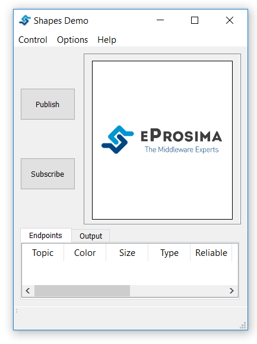
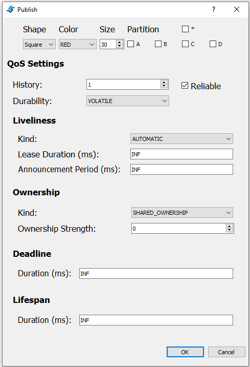
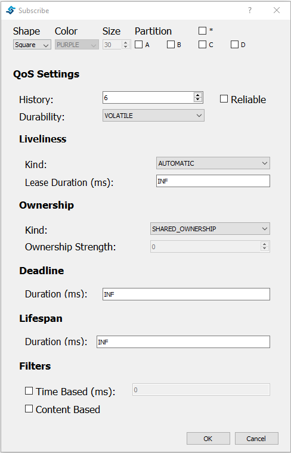

# eProsima Fast DDS Shapes Demo

eProsima Shapes Demo is an application in which Publishers and Subscribers are shapes of different colors and sizes
moving on a board.
Each shape refers to its own topic: Square, Triangle or Circle.
A single instance of the eProsima Shapes Demo can publish on or subscribe to several topics at a time.

It can be used to demonstrate the capabilities of eProsima *Fast DDS* or as a proof of interoperability with other
DDS/RTPS-compliant implementations.

## Installation from sources

For simplicity, the eProsima Shapes Demo installation manual follows the Colcon installation, since eProsima *Fast DDS*
and *Fast CDR* dependencies are downloaded and installed at the same time that eProsima Shapes Demo is built.
However, the user must assure that **Qt5** is installed, since it is a requirement for eProsima Shapes Demo.
To install eProsima Shapes Demo using Colcon, please follow the steps below:

1.  Install the eProsima *Fast DDS* dependencies and verify that the system meets the installation  requirements.
    The complete list of requirements and dependencies can be found in the
    [Fast DDS Linux Installation Manual](https://fast-dds.docs.eprosima.com/en/latest/installation/sources/sources_linux.html#linux-installation-from-sources).
    Specifically, follow the steps outlined in sections
    [Requirements](https://fast-dds.docs.eprosima.com/en/latest/installation/sources/sources_linux.html#requirements)
    and
    [Dependencies](https://fast-dds.docs.eprosima.com/en/latest/installation/sources/sources_linux.html#dependencies).

2.  Install the ROS 2 development tools ([Colcon](https://colcon.readthedocs.io/en/released/) and
    [Vcstool](https://pypi.org/project/vcstool/)) by executing the following command:

        $ pip install -U colcon-common-extensions vcstool

    If this fails due to an Environment Error, add the ``--user`` flag to the ``pip`` installation command.

    **Windows**: To build and run the application on Windows, add the path to the ``vcs`` executable to the ``PATH``
    from the *Edit the system environment variables* control panel. Moreover, set the *CMAKE_PREFIX_PATH* environmental
    variable to the Qt folder for the Visual Studio version you are compiling against (C:\Qt\5.7\msvc2015_64 for
    example). You will also need to add the /bin/ folder to the path (C:\Qt\5.7\msvc2015_64\bin for example).

3.  Create a `ShapesDemo` directory and download the repos file that will be used to install
    eProsima Shapes Demo and its dependencies:

        $ mkdir -p ShapesDemo/src && cd ShapesDemo
        $ wget https://raw.githubusercontent.com/eProsima/ShapesDemo/master/shapes-demo.repos
        $ vcs import src < shapes-demo.repos

4.  Build the packages:

        $ colcon build

### Linux

5.  Link the application executable to make it accessible from the current directory:

        $ source install/setup.bash

6.  Run eProsima Shapes Demo:

        $ ShapesDemo

### Windows

5.  Link the application executable to make it accessible from the current directory:

        $ setup.bat

6.  Run eProsima Shapes Demo:

        $ ShapesDemo

## Quick Demo

### Linux

eProsima provides the eProsima Fast DDS Suite Docker image for those who want a quick demonstration
of Fast DDS running on an Ubuntu platform. It can be downloaded from
[eProsima's downloads page](https://eprosima.com/index.php/downloads-all).

This Docker image was built for Ubuntu 20.04 (Focal Fossa).

To run this container you need **Docker installed**. From a terminal run the following command

	$ sudo apt-get install docker.io

Load the docker image:

	$ docker load -i ubuntu-fastdds-suite:<FastDDS-Version>.tar
	$ docker tag ubuntu-fastdds-suite:<FastDDS-Version> ubuntu-fastdds-suite:latest

Run the eProsima Fast DDS Suite Docker container:

    $ xhost local:root
    $ docker run -it --privileged -e DISPLAY=$DISPLAY -v /tmp/.X11-unix:/tmp/.X11-unix \
    ubuntu-fastdds-suite:<FastDDS-Version>

You can run the **Shapes Demo** application once inside the Docker container by running:

    $ ShapesDemo

eProsima **Shapes Demo** usage information can be found on the
[Shapes Demo First Steps page](https://eprosima-shapes-demo.readthedocs.io/en/latest/first_steps/first_steps.html).

Other than the Shapes Demo application, Fast DDS Suite also provides the following bundled in the same Docker image:

#### **Fast DDS Monitor**

eProsima Fast DDS Monitor is a graphical desktop application aimed at monitoring DDS environments
deployed using the *eProsima Fast DDS* library. Thus, the user can monitor in real time the status
of publication/subscription communications between DDS entities. They can also choose from a wide
variety of communication parameters to be measured (latency, throughput,packet loss, etc.), as well
as record and compute in real time statistical measurements on these parameters (mean, variance,
standard deviation, etc.).

You can read more about this application on the
[Fast DDS Monitor documentation page](https://fast-dds-monitor.readthedocs.io/).

To run this application once inside the Docker container run:

    $ fastdds_monitor

eProsima Fast DDS Monitor usage information can be found on the
[Fast DDS Monitor User Manual](
https://fast-dds-monitor.readthedocs.io/en/latest/rst/user_manual/initialize_monitoring.html).

#### **Fast DDS libraries and Examples**

Included in this Docker container is a set of binary examples that showcase several functionalities of the
Fast DDS libraries. These examples' path can be accessed from a terminal by typing

    $ goToExamples

From this folder you can access all examples, both for DDS and RTPS. We detail the steps to launch two such
examples below.

To launch the Hello World example (a minimal example that will perform a Publisher/Subscriber match and start
sending samples) you could run:

    $ goToExamples
    $ cd HelloWorldExample/bin
    $ tmux new-session "./HelloWorldExample publisher 0 1000" \; \
    split-window "./HelloWorldExample subscriber" \; \
    select-layout even-vertical

This example is not constrained to the current instance. It's possible to run several instances of this
container to check the communication between them by running the following from each container.

    $ goToExamples
    $ cd HelloWorldExample/bin
    $ ./HelloWorldExample publisher

or

    $ goToExamples
    $ cd HelloWorldExample/bin
    $ ./HelloWorldExample subscriber

Another example you could launch is the Benchmark example. This example creates either a Publisher or a Subscriber and
on a successful match starts sending samples. After a few seconds the process that launched the Publisher will show
a report with the number of samples transmitted.

On the subscriber side, run:

    $ goToExamples
    $ cd Benchmark/bin
    $ ./Benchmark subscriber udp

On the publisher side, run:

    $ goToExamples
    $ cd Benchmark/bin
    $ ./Benchmark publisher udp

### Windows

To install eProsima Shapes Demo from binaries just go to the [eProsima website](https://www.eprosima.com/) and
download the desired version of eProsima Shapes Demo.
Download links can be found [here](https://www.eprosima.com/index.php/products-all/eprosima-shapes-demo).

After downloading, unzip the content in the directory of preference and execute the file *ShapesDemo.exe* located in
the *bin* directory.

## Usage

This section serves as a guide to the main menus of eProsima Shapes Demo application.
After the executable is launched, a window similar to the one presented in the following image should be displayed.

### Publish

The Publish Window allows you to generate a new Shape and corresponding Topic on the network.

There are multiple parameters that the user can define in this menu:

- **Shape:** This parameter defines the topic where the publication is going to occur. Three different shapes can
  be published: ``Square``, ``Circle`` and ``Triangle``.
- **Color:** The user can define the color of the shape. This parameter will be used as key; that is, a way to
  distinguish between multiple instances of the same shape.
- **Size:** This parameter allows to control the size of the shape. The size can vary between ``1`` and ``99``.
- **Partition:** The user can select different partitions to differentiate groups of publishers and subscribers.
  The user can select between four partitions (``A``, ``B``, ``C`` and ``D``).
  Additionally the user can select the ``*`` partition, that will be matched against all other partitions.
  Note that using the wildcard (``*``) partition is not the same as not using any partition.
  A publisher that uses the wildcard partition will not be matched with a subscriber that do not defines any
  partitions.
- **Reliable:** The user can select to disable the ``Reliable`` check-box to use a ``Best-Effort`` publisher.
- **History and Durability:** The publishers's History is set to ``KEEP_LAST``.
  The user can select the number of samples that the publisher is going to save and whether this History is going to be
  ``VOLATILE`` or ``TRANSIENT_LOCAL``.
  The latter will send that last stored values to subscribers joining after the publisher has been created.
- **Liveliness:** The user can select the Liveliness QoS of the publisher from three different values:
  ``AUTOMATIC``, ``MANUAL_BY_PARTICIPANT`` and ``MANUAL_BY_TOPIC``. The Lease Duration value and Announcement Period
  can also be configured. The latter only applies if Liveliness is set to ``AUTOMATIC`` or ``MANUAL_BY_PARTICIPANT``.
- **Ownership:** The Ownership QoS determines whether the key (color) of a Topic (Shape) is owned by a single
  publisher.
  If the selected ownership is ``EXCLUSIVE`` the publisher will use the Ownership strength value as the
  strength of its publication.
  Only the publisher with the highest strength can publish in the same Topic with the same Key.
- **Deadline:** The Deadline QoS determines the maximum expected amount of time between samples.
  When the deadline is missed the application will be notified and a message will be printed on the console.
- **Lifespan:** The Lifespan QoS determines the duration while the sample is still valid.
  When a sample's lifespan expires, it will be removed from publisher and subscriber histories.
  Note that using Lifespan QoS will not have any visual effect.

### Subscribe

The Subscribe Window allows you to read and represent existing shapes on the network.

This menu provides the options present in the Publish window plus the following additions:

- **Liveliness:** This QoS policy is applied in the same way as in the publisher except for the Announcement Period,
  which does not apply for the Subscriber.
- **Time Based Filter:** This value can be used by the user to specify the minimum amount of time
  (in milliseconds) that the subscriber wants between updates.
- **Content Based Filter:** This filter draws a rectangle in the instances window.
  Only the shapes that are included in this rectangle are accepted while the rest of them are ignored.
  The user can dynamically resize and move this content filter.

Note that using Lifespan QoS will not have any visual effect.

## Miscellaneous Options and Windows

### Participant Configuration

Under the Options->Participant Configuration tab you will find the following menu:

You can modify the following settings:

- **Transport Protocol:**  You can select between UDP protocol, TCP LAN Server, TCP WAN Server or TCP Client,
  and Shared Memory protocol.
  - **UDP:** With UDP Protocol the applicacion will work sending multicast packets to communicate with other apps.
  - **TCP:** TCP protocol needs a minimal configuration to create the connection between the machines:
    - If the applicacion is going to run as a LAN server, it only needs to set the listening port where it is going to
      accept connections (note that firewall must be configured to allow inbound traffic).
    - If the applicacion is going to run as a WAN server, it needs to set the listening port where it is going to
      accept connections and the server WAN address (note that firewall must be configured to allow inbound traffic
      and router must relay listening port traffic to server machine).
    - If the applicacion is going to run as a client it needs to know the IP address of the server (or its WAN address
      if both instances don't share network) and the port where server is listening for connections.
  - **Shared Memory (SHM):** Activating Shared Memory protocol will use the Shared Memory Transport, a *Fast DDS* feature that
  allows a faster and more efficient communication for Participants running in the same host.
  - **Default** In case no transport has been activated, *Fast DDS* default transports will be used (UDP + SHM).

- **Same host delivery:**  *Fast DDS* has some features that allow Participants running in the same host or process
  to share resources in order to improve the communication:
  - **Intraprocess:** Allow using Intraprocess delivery when both Endpoints are running in the same process.
  - **Data Sharing:** Allow using Data Sharing delivery when both Endpoints are running in the same host.

- **Domain:** The user can select different Domain IDs.
  Shapes Demo instances using different Domain IDs will not communicate.
  To modify the Domain ID the user needs to stop the participant (thus removing all existing publishers and
  subscribers) and start a new one with the new Domain ID.

- **Statistics:** The user can activate *Fast DDS Statistics module* so different instrumentation data could be
  collected and analyzed by the *Fast DDS Statistics Backend*, or be represented by *Fast DDS Monitor*.
  This module requires to have compiled *Fast DDS* with Statistics Module ON.

In order to apply the changes done in this dialog, the current Participant must be stopped (in case it is running)
and a new one will be created with this new configuration.

### Preferences

Under the Options->Preferences tab you will find the following menu:

You can modify the following settings:

- **Update interval:** This value changes the publication period for all the publishers.
- **Speed:** This scroll bar allows the user to change how much the Shape moves between two write calls.

### Endpoints and Output tabs

A table including all created endpoints is also provided.

This table can be used to remove endpoints.
Two methods are provided:

- Right click in an endpoint: An option to remove the endpoint is shown.
- Pressing the delete button when the endpoint is selected.

The other available tab in this section shows an output log:

### ROS 2 Compatibility

By default eProsima Shapes Demo can be built and used on a ROS 2 installation as long as an installation of Fast DDS version 2.5.1 or higher is available and a QT5 installation is available.
The build process will try to locate the [Shapes Demo TypeSupport](https://github.com/eProsima/ShapesDemo-TypeSupport) and, if present, will automatically enable ROS2 features. The provided shapes-demo-ros2.repos file can be used to download Shapes Demo and its dependencies, including this TypeSupport, to your workspace.

With ROS 2 features enabled, an additional "Use ROS2 Topics" checkbox in the Participant configuration dialog will be shown.

When using eProsima Shapes Demo with this checkbox marked, ROS 2 will be aware of the Topics transmitted.

        $ ros2 topic list -t
        /Square [shapes_demo_typesupport/idl/KeylessShapeType]
        /parameter_events [rcl_interfaces/msg/ParameterEvent]
        /rosout [rcl_interfaces/msg/Log]

Since there's a TypeSupport available for these messages, it can be used by ROS 2 to interact with the different Shape topics. For instance, assuming the Shapes Demo TypeSupport was built along with Shapes Demo and is currently available in the current installation folder, a subscription to a Topic could be made like so:

        $ source install/setup.bash
        $ ros2 topic echo /Square
        color: RED
        x: 175
        y: 215
        shapesize: 30
        ---
        color: RED
        x: 169
        y: 210
        shapesize: 30
        ---

Analogously, a publication could be made like this:

        $ source install/setup.bash
        $ ros2 topic pub /Square shapes_demo_typesupport/idl/KeylessShapeType "{ color: BLUE, x: 155, y: 150, shapesize: 30}"
        publisher: beginning loop
        publishing #1: shapes_demo_typesupport.idl.KeylessShapeType(color='BLUE', x=155, y=150, shapesize=30)

---
**NOTE**

ROS 2 Topics enablement will disable some QoS that are not supported by ROS 2 at the moment, namely Ownership and Partitions.
Their respective checkboxes will be disabled on the Publisher and Subscriber Dialogs.

---
