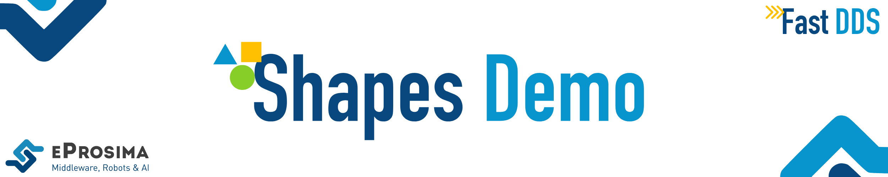

 

    <strong>
        <a href="https://eprosima.com/index.php/downloads-all">Download</a>
        &nbsp;&nbsp;•&nbsp;&nbsp;
        <a href="https://eprosima-shapes-demo.readthedocs.io/en/latest/">Docs</a>
        &nbsp;&nbsp;•&nbsp;&nbsp;
        <a href="https://eprosima.com/index.php/company-all/news">News</a>
        &nbsp;&nbsp;•&nbsp;&nbsp;
        <a href="https://x.com/EProsima">X</a>
        &nbsp;&nbsp;•&nbsp;&nbsp;
        <a href="mailto:info@eprosima.com">Contact Us</a>
    </strong>

  

    
    
    
    
    
     
    
    
    

  

eProsima Shapes Demo is an application in which Publishers and Subscribers are shapes of different colors and sizes
moving on a board.
Each shape refers to its own topic: Square, Triangle or Circle.
A single instance of the eProsima Shapes Demo can publish on or subscribe to several topics at a time.

It can be used to demonstrate the capabilities of eProsima *Fast DDS* or as a proof of interoperability with other
DDS/RTPS-compliant implementations.

  

## Commercial support

Looking for commercial support? Write us to info@eprosima.com

Find more about us at [eProsima’s webpage](https://eprosima.com/).

## Documentation

You can access the documentation online, which is hosted on [Read the Docs](https://eprosima-shapes-demo.readthedocs.io).

* [First Steps](https://eprosima-shapes-demo.readthedocs.io/en/latest/first_steps/first_steps.html)
* [Installation Manual](https://eprosima-shapes-demo.readthedocs.io/en/latest/installation/linux_sources.html)
* [User Manual & Examples](https://eprosima-shapes-demo.readthedocs.io/en/latest/examples/discovery.html)
* [Troubleshooting](https://eprosima-shapes-demo.readthedocs.io/en/latest/troubleshooting/troubleshooting.html)
